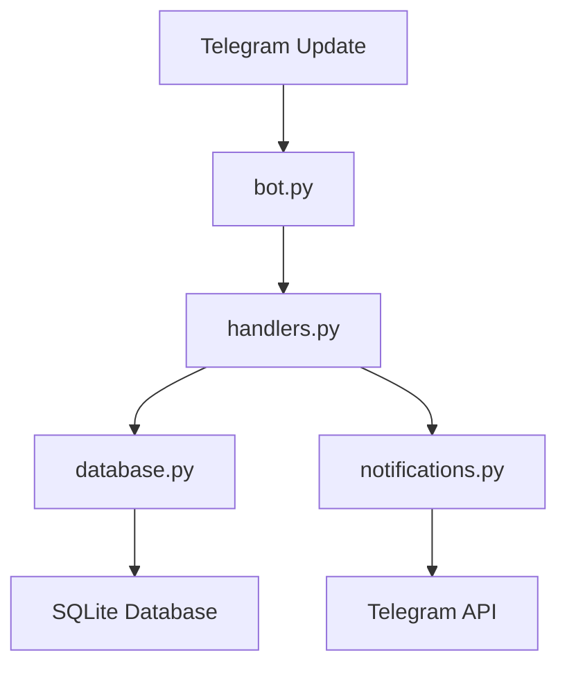

# 🏗️ Архитектура проекта

## 📋 Обзор

Проект построен по принципу **модульной архитектуры** с четким разделением ответственности между компонентами.

## 🔧 Основные компоненты

### 1. 🚀 `bot.py` - Главный файл (56 строк)
**Ответственность:** Инициализация и запуск бота

```python
class TelegramBot:
    def __init__(self):
        # Инициализация компонентов
        self.db = Database(DATABASE_PATH)
        self.user_handlers = UserHandlers(self.db)
        self.admin_handlers = AdminHandlers(self.db)
        self.notification_system = NotificationSystem(self.db, self.bot)
    
    def setup_handlers(self):
        # Регистрация обработчиков команд
        # и сообщений
```

**Ключевые особенности:**
- ✅ Минимальный код (всего 56 строк)
- ✅ Четкое разделение ответственности
- ✅ Простая инициализация компонентов
- ✅ Легко расширяемая структура

### 2. 🎮 `handlers.py` - Обработчики команд (430 строк)
**Ответственность:** Логика обработки команд пользователей и админа

#### `UserHandlers` - Обработчики пользователей
- `start_command()` - Приветствие и регистрация
- `handle_message()` - Обработка текстовых сообщений
- `handle_callback()` - Обработка inline кнопок
- `send_free_materials()` - Выдача бесплатных материалов
- `send_products_menu()` - Показ платных продуктов

#### `AdminHandlers` - Обработчики админа
- `admin_command()` - Админ-панель
- `meeting_command()` - Создание встреч
- `offer_command()` - Создание предложений
- `send_meeting_invitation()` - Отправка приглашений
- `send_special_offer()` - Отправка предложений

### 3. 🗄️ `database.py` - База данных (217 строк)
**Ответственность:** Работа с SQLite базой данных

```python
class Database:
    def __init__(self, db_path: str):
        self.db_path = db_path
        self.init_database()
    
    def init_database(self):
        # Автоматическое создание таблиц
        # users, products, orders, notifications
```

**Таблицы:**
- `users` - Пользователи и их данные
- `products` - Платные продукты
- `orders` - Заказы пользователей
- `notifications` - Уведомления и анонсы

### 4. 🔔 `notifications.py` - Система уведомлений (253 строки)
**Ответственность:** Планировщик и отправка уведомлений

```python
class NotificationSystem:
    async def start_scheduler(self):
        # Запуск планировщика уведомлений
        # Проверка каждую минуту
    
    async def send_notification(self, notification):
        # Отправка уведомлений пользователям
```

**Функции:**
- Планировщик уведомлений
- Отправка массовых сообщений
- Фильтрация по целевой аудитории

### 5. ⚙️ `config.py` - Конфигурация (45 строк)
**Ответственность:** Настройки и константы

```python
# Настройки бота
BOT_TOKEN = os.getenv('BOT_TOKEN')
ADMIN_ID = int(os.getenv('ADMIN_ID', 0))

# Бесплатные материалы
FREE_MATERIALS = {
    'welcome_message': 'Добро пожаловать!',
    'materials': ['📚 Основы', '🎯 Как работает', '💡 Советы']
}
```

## 🔄 Поток данных



## 🎯 Принципы дизайна

### 1. **Разделение ответственности**
- Каждый модуль отвечает за свою область
- Четкие интерфейсы между компонентами
- Минимальные зависимости

### 2. **Простота и читаемость**
- Код легко понять и модифицировать
- Подробные комментарии и документация
- Логичная структура файлов

### 3. **Расширяемость**
- Модульная архитектура
- Простое добавление новых функций
- Гибкая система обработчиков

### 4. **Безопасность**
- Валидация входных данных
- Проверка прав доступа
- Безопасное хранение данных

## 📁 Структура файлов

```
bot_kate/
├── 🚀 bot.py              # Главный файл (56 строк)
├── 🎮 handlers.py         # Обработчики команд (430 строк)
├── 🗄️ database.py         # База данных (217 строк)
├── 🔔 notifications.py    # Уведомления (253 строки)
├── ⚙️ config.py           # Конфигурация (45 строк)
├── 🧪 test_bot.py         # Тестирование (96 строк)
├── 📖 README.md           # Документация
├── 🏗️ ARCHITECTURE.md     # Этот файл
├── 🔧 SETUP.md            # Инструкция по настройке
├── ⚡ QUICK_START.md      # Быстрый старт
└── 📦 requirements.txt    # Зависимости
```

## 🔧 Добавление новых функций

### 1. **Новая команда пользователя**
```python
# В handlers.py, класс UserHandlers
async def new_command(self, update, context):
    # Логика команды
    pass

# В bot.py
self.application.add_handler(CommandHandler("new", self.user_handlers.new_command))
```

### 2. **Новая таблица в БД**
```python
# В database.py
def init_database(self):
    cursor.execute('''
        CREATE TABLE IF NOT EXISTS new_table (
            id INTEGER PRIMARY KEY,
            name TEXT
        )
    ''')
```

### 3. **Новый тип уведомлений**
```python
# В notifications.py
async def send_new_notification(self, data):
    # Логика отправки
    pass
```

## 📊 Метрики качества

- **Общий размер кода:** ~1,200 строк
- **Главный файл:** 56 строк (4.7%)
- **Модульность:** 5 основных модулей
- **Документация:** 4 файла документации
- **Тесты:** Встроенное тестирование

## 🎉 Преимущества архитектуры

1. **Легко понять** - код структурирован логично
2. **Просто расширять** - модульная система
3. **Удобно поддерживать** - четкое разделение
4. **Быстро отлаживать** - изолированные компоненты
5. **Просто развертывать** - минимальные зависимости

---

*Архитектура спроектирована для максимальной простоты и удобства разработки* 🚀 