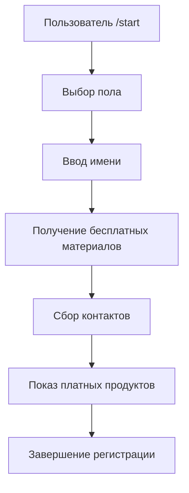

# 🤖 Telegram Bot для Kate

> Интеллектуальный бот для автоматизации процесса привлечения клиентов, выдачи материалов и продажи продуктов.

## ✨ Возможности

| Функция | Описание |
|---------|----------|
| 🌟 **Приветствие** | Автоматическое знакомство с новыми пользователями |
| 📝 **Сбор данных** | Пол, имя, контакты пользователя |
| 📚 **Бесплатные материалы** | Автоматическая выдача ознакомительных материалов |
| ❓ **Анонимные вопросы** | Ссылка на форму для вопросов |
| 📞 **Диагностические созвоны** | Сбор контактов для бесплатных консультаций |
| 💎 **Платные продукты** | Меню продуктов с возможностью покупки |
| 🔔 **Уведомления** | Автоматические напоминания и анонсы |
| 👑 **Админ-панель** | Полное управление пользователями и контентом |

## 🏗️ Архитектура проекта

```
bot_kate/
├── 📁 Основные файлы
│   ├── bot.py              # 🚀 Главный файл бота (всего 50 строк!)
│   ├── handlers.py         # 🎮 Обработчики команд пользователей и админа
│   ├── database.py         # 🗄️ Модуль для работы с базой данных
│   ├── notifications.py    # 🔔 Система уведомлений
│   ├── shop.py             # 🛒 Модуль магазина и заказов
│   ├── api.py              # 🌐 FastAPI сервер для веб-интерфейса
│   └── config.py           # ⚙️ Конфигурация и настройки
│
├── 📁 Веб-интерфейс
│   └── web-admin/          # 🖥️ Vue.js админ-панель
│       ├── src/            # Исходный код
│       ├── package.json    # Зависимости Node.js
│       └── README.md       # Инструкция по запуску
│
├── 📁 Документация
│   ├── README.md           # 📖 Основная документация
│   ├── SETUP.md            # 🔧 Подробная инструкция по настройке
│   ├── QUICK_START.md      # ⚡ Быстрый старт за 5 минут
│   ├── WEB_ADMIN_SETUP.md  # 🌐 Настройка веб-интерфейса
│   └── SHOP_DEMO.md        # 🛒 Демо магазина
│
├── 📁 Зависимости
│   ├── requirements.txt    # 📦 Список Python пакетов
│   ├── env_example.txt     # 📝 Пример переменных окружения
│   └── venv/               # 🐍 Виртуальное окружение Python
│
└── 📁 Тестирование
    ├── test_bot.py         # 🧪 Скрипт тестирования
    └── bot_database.db     # 💾 База данных SQLite
```

## 🚀 Быстрый старт

### 1. Установка
```bash
# Клонируйте проект
git clone <your-repo>
cd bot_kate

# Создайте виртуальное окружение
python -m venv venv

# Активируйте окружение
.\venv\Scripts\Activate.ps1  # Windows
source venv/bin/activate     # Linux/Mac

# Установите зависимости
pip install -r requirements.txt
```

### 2. Настройка
```bash
# Скопируйте настройки
copy env_example.txt .env

# Отредактируйте .env файл:
BOT_TOKEN=ваш_токен_бота
ADMIN_ID=ваш_telegram_id
ANONYMOUS_QUESTION_LINK=ссылка_на_форму
```

### 3. Запуск
```bash
# Протестируйте
python test_bot.py

# Запустите бота
python bot.py
```

## 📱 Как работает бот

### 🔄 Жизненный цикл пользователя



### 🎯 Команды бота

| Команда | Описание | Доступ |
|---------|----------|---------|
| `/start` | Начать работу с ботом | 👥 Все пользователи |
| `/help` | Справка по командам | 👥 Все пользователи |
| `/admin` | Админ-панель | 👑 Только администратор |
| `/meeting` | Создать встречу | 👑 Только администратор |
| `/offer` | Создать предложение | 👑 Только администратор |

## 👑 Админ-панель

### 🌐 Веб-интерфейс
- **Красивый дашборд** с аналитикой в реальном времени
- **Управление пользователями** с фильтрацией и редактированием
- **Каталог продуктов** с возможностью создания и изменения
- **Управление заказами** со сменой статусов
- **Система уведомлений** с массовыми рассылками
- **Мобильная адаптация** для управления с любого устройства

### 📊 Статистика
- Общее количество пользователей
- Новые пользователи за день
- Активные пользователи
- Общий доход и популярные продукты

### 🎯 Управление контентом
- Отправка уведомлений
- Создание встреч
- Специальные предложения

### 👥 Управление пользователями
- Просмотр списка пользователей
- Фильтрация по этапам
- Редактирование профилей
- История заказов

## 🔧 Технические детали

### 🗄️ База данных
- **SQLite** - легкая и быстрая
- **Автоматическое создание** таблиц
- **Безопасное хранение** пользовательских данных

### 🚀 Производительность
- **Асинхронная обработка** сообщений
- **Оптимизированные запросы** к БД
- **Минимальное потребление** ресурсов

### 🔒 Безопасность
- **Валидация** входящих данных
- **Проверка прав** доступа
- **Логирование** всех действий

## 📋 Требования

- **Python 3.8+**
- **Telegram Bot Token**
- **Административные права** для управления

## 🎨 Особенности дизайна

- **Минималистичный код** - легко читать и понимать
- **Модульная архитектура** - простое расширение функционала
- **Чистые интерфейсы** - понятные методы и классы
- **Документированный код** - подробные комментарии

## 🔄 Обновления

### Версия 1.0
- ✅ Основной функционал бота
- ✅ Система регистрации пользователей
- ✅ Админ-панель
- ✅ Система уведомлений

### Планы на будущее
- ✅ Интеграция с платежными системами (частично)
- ✅ Веб-интерфейс для админа
- ✅ Аналитика и отчеты
- ✅ Публичный сайт с каталогом
- 🔄 Многоязычная поддержка

## 📞 Поддержка

Если у вас возникли вопросы:

1. **Проверьте логи** бота
2. **Убедитесь**, что все зависимости установлены
3. **Проверьте** правильность настройки `.env` файла
4. **Убедитесь**, что токен бота действителен

## 📝 Лицензия

Этот проект создан для личного использования. Все права защищены.

---

**🎉 Удачи с вашим ботом!**

*Создано с ❤️ для автоматизации бизнес-процессов* 